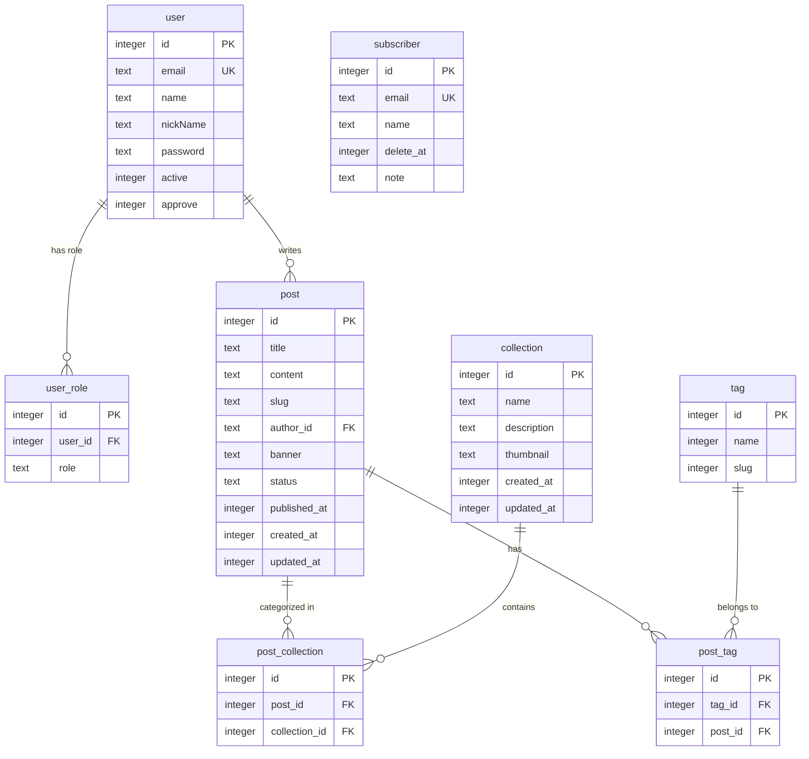

# 📝 Cloudian Blog (Blogging Website)

<div align="center">

[](https://bun.sh)
[](https://hono.dev)
[](https://developers.cloudflare.com/d1/)
[](https://orm.drizzle.team)
[](https://www.typescriptlang.org)

</div>

---

## 🔍 Overview

**Cloudian Blog** is a modern, high-performance personal blogging platform built as a monorepo using **Bun Workspaces**.

The backend architecture is designed around **Hono** running on **Cloudflare Workers**. It utilizes **Cloudflare D1** (serverless SQL database based on SQLite) as the primary database, paired with **Drizzle ORM** for lightweight schema management, migrations, and type-safe queries. The project also features built-in OpenAPI schema generation and a **Scalar** user interface for interactive API exploration.

---

## 📊 Database Schema

Below is the entity-relationship diagram representing the Drizzle schema configured for SQLite/D1:



---

## 🚀 How to Setup and Run Backend

Follow these steps to configure your local environment and run the backend API server.

### 📋 Prerequisites

Ensure you have [Bun](https://bun.sh) installed.

### 1. Install Dependencies

Run the following command at the root of the workspace to install all dependencies for both the workspace and individual applications:

```bash
bun install
```

### 2. Cloudflare Authentication

Log in to your Cloudflare account using Wrangler CLI:

```bash
bun --cwd apps/backend wrangler login
```

### 3. Create Cloudflare D1 Database

Create a local D1 database:

```bash
bun --cwd apps/backend wrangler d1 create blogging-database
```

_Note: This command will generate a JSON block containing your database name, database ID, and binding name. Copy this configuration._

### 4. Configure wrangler.jsonc

Update [apps/backend/wrangler.jsonc](file:///home/cloud/workspace/web/blogging-website/apps/backend/wrangler.jsonc) with the database details received from the command above:

```json
{
    "name": "blog-api",
    "main": "./src/index.ts",
    "compatibility_date": "2026-07-13",
    "d1_databases": [
        {
            "binding": "blogging_database",
            "database_name": "blogging-database",
            "database_id": "YOUR_DATABASE_ID"
        }
    ]
}
```

### 5. Generate and Apply Database Migrations

Create your initial database schema and tables by generating and applying migrations:

```bash
# Generate SQL migration files using Drizzle Kit
bun --cwd apps/backend x drizzle-kit generate

# Apply the migrations to your local SQLite database instance
bun --cwd apps/backend x wrangler d1 migrations apply blogging-database --local
```

### 6. Start the Development Server

Run the Hono application on a local development server:

```bash
bun --filter backend dev
```

The server will start running at `http://localhost:3000`.

- **Scalar API Documentation:** [http://localhost:3000/scalar](http://localhost:3000/scalar)
- **OpenAPI Spec Endpoint:** [http://localhost:3000/openapi](http://localhost:3000/openapi)

### 7. Run Drizzle Studio (Optional)

To view and manage your local database tables visually, run Drizzle Studio:

```bash
bun --filter backend studio
```

Build with Cloudian 💙 Cloud - 2026
