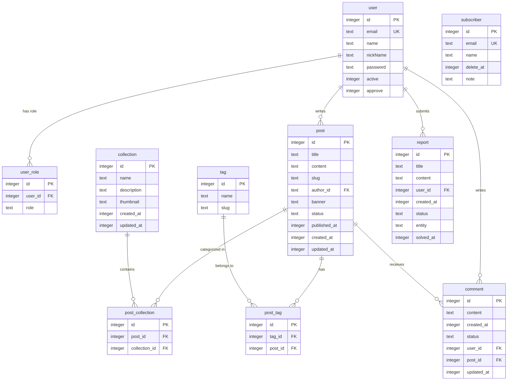

# ⚙️ Cloudian Blog - Backend API

<div align="center">

[](https://bun.sh)
[](https://hono.dev)
[](https://developers.cloudflare.com/d1/)
[](https://orm.drizzle.team)
[](https://www.typescriptlang.org)

</div>

---

## 🔍 Backend Overview

This is the backend API service for **Cloudian Blog**, built as a serverless application using **Hono** framework designed to run on **Cloudflare Workers**.

### Core Architecture Features:

- **Hono Routing:** Highly performant web framework with middleware support.
- **Cloudflare D1:** Serverless SQL database (SQLite-based) with global replication.
- **Drizzle ORM:** Lightweight, type-safe ORM for relational queries, modeling, and automated migrations.
- **Zod & OpenAPI Integration:** Automatic request/response validation and interactive API documentation powered by **Scalar**.
- **Type-safe Email Templates:** Mail transmission via `Nodemailer` using clean TypeScript function templates (solving `EvalError` runtime sandbox blocks on Cloudflare Workers).

---

## 📊 Database Schema (ERD)



---

## 🚀 How to Setup and Run Locally

### 1. Install Dependencies

Make sure you are in the `apps/backend` directory or run the command referencing it:

```bash
bun install
```

### 2. Login to Cloudflare Wrangler

Authenticate with your Cloudflare account to manage local resources:

```bash
bunx wrangler login
```

### 3. Create a Local D1 Database

Create the database to obtain your credentials/binding details:

```bash
bunx wrangler d1 create blogging-database
```

Add the returned JSON configuration details to your `wrangler.jsonc` file:

```json
  "d1_databases": [
    {
      "binding": "blogging_database",
      "database_name": "blogging-database",
      "database_id": "YOUR_DATABASE_ID"
    }
  ]
}
```

### 4. Database Schema Migration

First, generate the migration files from Drizzle models:

```bash
bunx drizzle-kit generate
```

Then apply the migrations locally to initialize the SQLite database:

```bash
bunx wrangler d1 migrations apply blogging-database --local
```

### 5. Database Seeding

Populate the database with test data:

```bash
# Delete existing sqlite files and run migrations & seeding from scratch
rm -f .wrangler/state/v3/d1/miniflare-D1DatabaseObject/*.sqlite*
bunx wrangler d1 migrations apply blogging-database --local
bun run seed
```

### 6. Start Development Server

Run the API locally (defaults to port `3000` via Wrangler):

```bash
bun run dev
```

- **Interactive API Reference:** [http://localhost:3000/scalar](http://localhost:3000/scalar)
- **OpenAPI Specs JSON:** [http://localhost:3000/openapi](http://localhost:3000/openapi)

### 7. Query DB visually with Drizzle Studio

To view tables and manipulate data using a browser GUI, run:

```bash
bun run studio
```
