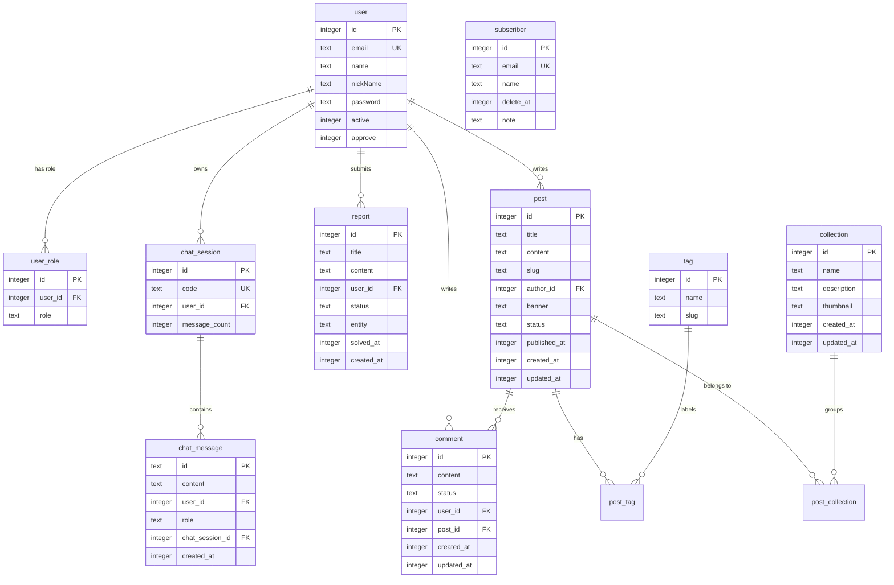

# Backend PRD (Product Requirements Document) — Cloudian Blog API

> **Mục tiêu tài liệu:** Tài liệu này mô tả toàn bộ hệ thống Backend của **Cloudian Blog**, bao gồm kiến trúc, cơ sở dữ liệu, các luồng xử lý nghiệp vụ, đặc tả API chi tiết, hệ thống AI Agent, cấu hình môi trường và hướng dẫn thiết lập cục bộ. Được viết cho **lập trình viên Frontend** và **AI coding agents** để tích hợp chính xác.

---

## Mục lục

1. [Tổng quan kiến trúc](#1-tổng-quan-kiến-trúc)
2. [Cơ sở dữ liệu & Schema](#2-cơ-sở-dữ-liệu--schema)
3. [Hệ thống phân quyền](#3-hệ-thống-phân-quyền)
4. [Luồng xử lý nghiệp vụ](#4-luồng-xử-lý-nghiệp-vụ)
5. [Đặc tả API Chi tiết](#5-đặc-tả-api-chi-tiết)
6. [Hệ thống AI Agent Chat](#6-hệ-thống-ai-agent-chat)
7. [Upload ảnh Cloudinary](#7-upload-ảnh-cloudinary)
8. [Hệ thống gửi Email](#8-hệ-thống-gửi-email)
9. [Biến môi trường](#9-biến-môi-trường)
10. [Hướng dẫn thiết lập cục bộ](#10-hướng-dẫn-thiết-lập-cục-bộ)
11. [Xử lý lỗi chung](#11-xử-lý-lỗi-chung)

---

## 1. Tổng quan kiến trúc

### Stack công nghệ

| Thành phần      | Công nghệ                                |
|-----------------|------------------------------------------|
| **Runtime**     | Cloudflare Workers (Serverless, edge)    |
| **Framework**   | Hono v4 (ultrafast routing + middleware) |
| **ORM**         | Drizzle ORM (type-safe, lightweight)     |
| **Database**    | Cloudflare D1 (SQLite-based, serverless) |
| **Validation**  | Zod + hono-openapi                       |
| **API Docs**    | Scalar (OpenAPI interactive UI)          |
| **AI Engine**   | Langchain + Mistral AI (`mistral-large-latest`) |
| **Email**       | Nodemailer (TypeScript template, non-eval) |
| **Media Store** | Cloudinary (direct browser upload)       |
| **Auth**        | JWT (access + refresh + verify tokens)   |
| **Build Tool**  | Bun + Wrangler (Cloudflare CLI)          |

### Cấu trúc thư mục Backend

```
apps/backend/
├── src/
│   ├── index.ts              # Entrypoint: đăng ký middleware, routes, error handler
│   ├── agent/
│   │   ├── llm.ts            # buildAgent() — khởi tạo LangChain agent
│   │   ├── model.ts          # Mistral model + sanitizeMessagesForMistral()
│   │   ├── prompt.ts         # SYSTEM_PROMPT cho AI assistant
│   │   ├── tools/index.ts    # Định nghĩa tất cả LangChain tools
│   │   └── skills/           # SKILL.md guidelines cho agent
│   ├── controller/           # Route handlers (Hono routes)
│   ├── service/              # Business logic layer
│   ├── model/                # Drizzle schema (bảng DB)
│   ├── schema/               # Zod validation DTOs
│   ├── middleware/
│   │   ├── auth.middleware.ts    # JWT verification
│   │   ├── database.middleware.ts # Inject D1 DB vào context
│   │   └── role.middlware.ts    # RBAC role checking
│   ├── helper/               # Utilities (pwd hash, chat security)
│   ├── template/             # Email HTML templates
│   ├── types/
│   │   ├── env.ts            # Cloudflare Bindings (env vars) type
│   │   └── jwt.ts            # JWT payload types
│   └── core/                 # Cloudinary config
├── migrations/               # Drizzle SQL migration files
├── drizzle.config.ts         # Drizzle config (sqlite path)
├── wrangler.jsonc            # Cloudflare Workers config (bindings, vars)
├── package.json
└── seed.ts                   # Script seed dữ liệu test
```

### Base URL

- **Local:** `http://localhost:3000/api`
- **API Docs (Scalar):** `http://localhost:3000/scalar`
- **OpenAPI JSON:** `http://localhost:3000/openapi`

---

## 2. Cơ sở dữ liệu & Schema

### Sơ đồ ERD



### Chi tiết các bảng

#### `user`
| Cột       | Kiểu    | Mô tả                                                     |
|-----------|---------|-----------------------------------------------------------|
| `id`      | INTEGER | Primary key, auto increment                               |
| `email`   | TEXT    | Email đăng nhập, unique                                   |
| `name`    | TEXT    | Tên hiển thị                                              |
| `nickName`| TEXT    | Biệt danh (optional)                                      |
| `password`| TEXT    | Mật khẩu đã hash bằng bcrypt                              |
| `active`  | INTEGER | `1` = tài khoản đã xác minh email, `0` = chưa xác minh   |
| `approve` | INTEGER | `1` = được phép đăng nhập, `0` = bị chặn                 |

#### `user_role`
Bảng join N-N giữa `user` và role. Mỗi user có thể có nhiều role.

| `role` enum values | Mô tả                                           |
|--------------------|--------------------------------------------------|
| `admin`            | Toàn quyền hệ thống                              |
| `manager`          | Quản lý bài viết, tạo/sửa bài, đọc comment admin |
| `user`             | Đọc bài, comment, chat AI, report                |

#### `post`
| Cột           | Kiểu    | Mô tả                                          |
|---------------|---------|------------------------------------------------|
| `status`      | TEXT    | `'published'` hoặc `'draft'`                   |
| `published_at`| INTEGER | Unix timestamp (ms) thời điểm xuất bản         |
| `banner`      | TEXT    | URL ảnh bìa (Cloudinary URL)                   |
| `slug`        | TEXT    | URL-friendly identifier, unique. Chú ý: slug không được toàn số |
| `content`     | TEXT    | Nội dung bài viết dạng HTML/Markdown           |

#### `comment`
| `status` value | Mô tả                        |
|----------------|------------------------------|
| `active`       | Bình luận hiển thị bình thường |
| `invalid`      | Bình luận bị ẩn bởi Admin/Manager |

#### `report`
| `status` value | Mô tả               |
|----------------|---------------------|
| `pending`      | Chờ xử lý           |
| `solved`       | Đã xử lý xong       |
| `cancel`       | Bị từ chối/bỏ qua   |

| `entity` value | Mô tả                         |
|----------------|-------------------------------|
| `post`         | Báo cáo về một bài viết       |
| `comment`      | Báo cáo về một bình luận      |

#### `chat_session`
| Cột            | Mô tả                                          |
|----------------|------------------------------------------------|
| `code`         | Mã phiên chat dạng `chat_{timestamp}_{random}`, unique |
| `message_count`| Số lượng message trong session (user + AI)    |

#### `chat_message`
| `role` value  | Mô tả                  |
|---------------|------------------------|
| `user`        | Tin nhắn do người dùng gửi |
| `assistant`   | Phản hồi từ AI agent   |

---

## 3. Hệ thống phân quyền

### Middleware hoạt động

**Luồng xác thực:**
```
Request → AuthMiddleware → verifyToken(JWT_ACCESS_SECRET) → c.set('user', payload) → next()
```

**Luồng phân quyền:**
```
AuthMiddleware → requireRole(...roles) → user.roles includes any required role → next()
```

**JWT Payload (`AccessJwtPayload`):**
```json
{
  "sub": "1",           // user ID (dạng string trong token, ép kiểu Number khi dùng)
  "email": "user@example.com",
  "roles": ["user", "manager"],
  "iat": 1721389400,
  "exp": 1721389700
}
```

### Phân quyền theo endpoint

| Endpoint                    | Yêu cầu          |
|-----------------------------|-------------------|
| `GET /api/posts`            | Public            |
| `GET /api/posts/:slugOrId`  | Public            |
| `GET /api/collections`      | Public            |
| `GET /api/tags`             | Public            |
| `GET /api/comments/post/:id`| Public            |
| `POST /api/auth/login`      | Public            |
| `POST /api/auth/login-google`| Public           |
| `POST /api/auth/register`   | **ADMIN only**    |
| `POST /api/posts`           | **MANAGER only**  |
| `PUT /api/posts/:id`        | **MANAGER only** (tác giả) |
| `DELETE /api/posts/:id`     | **MANAGER** (tác giả) hoặc **ADMIN** |
| `PATCH /api/posts/:id/status`| **ADMIN only**   |
| `POST /api/chat/session`    | Đã đăng nhập (bất kỳ role) |
| `POST /api/chat/message`    | Đã đăng nhập (bất kỳ role) |
| `GET /api/comments`         | **ADMIN hoặc MANAGER** |
| `PUT /api/comments/:id/status`| **ADMIN hoặc MANAGER** |
| `POST /api/comments/post/:id`| **USER** (đã đăng nhập) |
| `GET /api/reports`          | **ADMIN only**    |
| `GET /api/subscribers`      | **ADMIN only**    |
| `POST /api/subscribers`     | Public            |

---

## 4. Luồng xử lý nghiệp vụ

### 4.1 Luồng Đăng ký tài khoản (Manager)

Chỉ Admin mới có thể tạo tài khoản mới (Manager accounts):

```
Admin gọi POST /api/auth/register
  │
  ├── Backend tạo user record (active=0, approve=1)
  ├── Tạo JWT verify token (ký bằng JWT_VERIFY_REGISTER)
  ├── Gửi email qua SMTP có link: {FE_URL}/verify?code={verifyToken}
  │
Frontend/User mở link email
  │
  └── GET /api/auth/verify?code={token}
        ├── Backend verify JWT token
        ├── Cập nhật user.active = 1
        └── Trả về text "User account has been active"
```

### 4.2 Luồng Đăng nhập thường (Email + Password)

```
POST /api/auth/login { email, password }
  │
  ├── Tìm user theo email
  ├── Kiểm tra user.active === 1 (đã xác minh email)
  ├── Kiểm tra user.approve === 1 (chưa bị chặn)
  ├── So khớp password với bcrypt
  ├── Tạo accessToken (ký JWT_ACCESS_SECRET, TTL ngắn)
  └── Tạo refreshToken (ký JWT_REFRESH_SECRET, TTL dài)
  
Response: { accessToken, refreshToken }
```

### 4.3 Luồng Đăng nhập Google OAuth

```
Frontend lấy idToken từ Google OAuth client
  │
  └── POST /api/auth/login-google { idToken }
        ├── Backend verify idToken với Google's public keys
        ├── Lấy email, name từ Google payload
        ├── Tìm hoặc tạo mới user (provider=google, active=1, approve=1, role=USER)
        ├── Tạo accessToken + refreshToken
        └── Response: { accessToken, refreshToken }
```

> **Lưu ý cho FE:** Sau khi đăng nhập Google lần đầu, user có thể thiết lập password qua chức năng Forgot Password.

### 4.4 Luồng Refresh Token

```
POST /api/auth/refresh { token: refreshToken }
  │
  ├── Verify refreshToken (JWT_REFRESH_SECRET)
  ├── Tạo accessToken mới
  └── Response: { accessToken }
```

> **Lưu ý cho FE:** Khi API trả về `401`, FE nên tự động gọi `/refresh` để lấy accessToken mới. Nếu refresh cũng thất bại, điều hướng user về trang đăng nhập.

### 4.5 Luồng Quên mật khẩu

```
GET /api/auth/forgot-password?email={email}
  │
  ├── Tìm user theo email
  ├── Tạo reset token (JWT_VERIFY_RESET_PASSWORD)
  ├── Gửi email có link: {FE_URL}/reset-password?token={resetToken}
  └── Response: { token } (dùng cho test local)

POST /api/auth/change-password?token={resetToken} { password }
  │
  ├── Verify resetToken
  ├── Hash password mới bằng bcrypt
  └── Cập nhật user.password
```

### 4.6 Luồng Thay đổi Email

```
POST /api/auth/change-email { password, email: newEmail }  [Auth required]
  │
  ├── Verify mật khẩu hiện tại
  ├── Tạo verify token (JWT_VERIFY_RESET_EMAIL) chứa newEmail
  ├── Gửi email xác minh đến newEmail
  └── Response: { token }

GET /api/auth/verify-change-email?token={token}
  │
  ├── Verify token, lấy newEmail
  ├── Cập nhật user.email = newEmail
  └── Response: text "Account's email has been reset successfully"
```

### 4.7 Luồng tạo & xuất bản bài viết

```
Manager tạo bài: POST /api/posts { title, content, slug, banner?, tagIds?, collectionIds? }
  └── Tạo bài viết với status = 'draft'
  └── Gắn tags và collections nếu có

Manager chỉnh sửa: PUT /api/posts/:postId { ...fields }
  └── Chỉ tác giả (authorId === userId) mới được sửa
  └── Nếu có tagIds → cập nhật post_tag (diff + upsert)
  └── Nếu có collectionIds → cập nhật post_collection (diff + upsert)

Admin publish: PATCH /api/posts/:postId/status { status: 'published' }
  └── Cập nhật post.status và post.published_at = now()
```

> **Lưu ý quan trọng:** Chỉ **ADMIN** mới có thể thay đổi status (publish/unpublish). **MANAGER** chỉ được tạo và chỉnh sửa nội dung bài viết của mình.

### 4.8 Luồng Upload ảnh (Cloudinary)

Xem chi tiết tại [Mục 7](#7-upload-ảnh-cloudinary).

### 4.9 Luồng Comment

```
Public: GET /api/comments/post/:postId
  └── Chỉ trả về comment có status = 'active'

Đăng nhập (USER): POST /api/comments/post/:postId { content }
  └── Tạo comment mới với status = 'active'

Đăng nhập (USER/ADMIN): DELETE /api/comments/:commentId
  └── Chỉ tác giả comment hoặc Admin/Manager mới được xóa

Admin/Manager: PUT /api/comments/:commentId/status { status: 'active' | 'invalid' }
  └── Thay đổi trạng thái comment (ẩn/hiện)
```

---

## 5. Đặc tả API Chi tiết

### Header xác thực

Mọi endpoint yêu cầu đăng nhập đều cần:
```
Authorization: Bearer {accessToken}
```

---

### 5.1 Auth (`/api/auth`)

#### `POST /api/auth/login`
```json
// Request Body
{ "email": "admin@gmail.com", "password": "cloudian123" }

// Response 200
{ "accessToken": "eyJ...", "refreshToken": "eyJ..." }
```

#### `POST /api/auth/register` _(ADMIN only)_
```json
// Request Body
{
  "email": "newmanager@gmail.com",
  "password": "Password123!",
  "name": "New Manager",
  "nickName": "newmanager"   // optional
}

// Response 200
{
  "user": { "id": 5, "email": "newmanager@gmail.com", "name": "New Manager" },
  "verifyToken": "eyJ..."
}
```

#### `GET /api/auth/verify?code={verifyToken}`
```
// Response 200 (text)
"User account has been active"
```

#### `POST /api/auth/login-google`
```json
// Request Body
{ "idToken": "google_id_token_here" }

// Response 200
{ "accessToken": "eyJ...", "refreshToken": "eyJ..." }
```

#### `POST /api/auth/refresh`
```json
// Request Body
{ "token": "eyJ...refreshToken..." }

// Response 200
{ "accessToken": "eyJ...newAccessToken..." }
```

#### `GET /api/auth/forgot-password?email={email}`
```json
// Response 200
{ "token": "eyJ...resetToken..." }
// Đồng thời gửi email về {email} với link reset
```

#### `POST /api/auth/change-password?token={resetToken}`
```json
// Request Body
{ "password": "NewPassword123!" }

// Response 200 (text)
"Password has been reset"
```

#### `POST /api/auth/change-email` _(Auth required)_
```json
// Request Body
{ "password": "CurrentPassword123!", "email": "newemail@example.com" }

// Response 200
{ "token": "eyJ...changeEmailToken..." }
```

#### `GET /api/auth/verify-change-email?token={token}`
```
// Response 200 (text)
"Account's email has been reset successfully"
```

---

### 5.2 Posts (`/api/posts`)

#### `GET /api/posts` — Lấy danh sách bài viết công khai
```
Query params (tất cả optional):
  ?keyword=hono        // Tìm theo tiêu đề (exact match)
  ?tag=React           // Lọc theo tên tag
  ?collection=1        // Lọc theo collection ID (number)
  ?limit=20            // Số bài mỗi trang (default: không giới hạn nếu 0)
  ?offset=0            // Phân trang offset
```

```json
// Response 200 — Mảng các bài viết
[
  {
    "id": 1,
    "title": "Building Fast APIs with Hono",
    "slug": "building-fast-apis-with-hono",
    "banner": "https://res.cloudinary.com/.../sample.jpg",
    "publishedAt": "2025-05-20T10:30:00.000Z",
    "author": { "name": "Admin User", "nickName": "admin" },
    "tags": [{ "id": 1, "name": "Technology", "slug": "technology" }],
    "collections": [{ "id": 1, "name": "Backend Masterclass" }]
  }
]
```

> ⚠️ **Quan trọng:** Endpoint này **chỉ trả về bài viết có status = 'published'**. Draft posts sẽ không xuất hiện.

#### `GET /api/posts/me` _(Auth required)_
Lấy tất cả bài viết của user đang đăng nhập (bao gồm cả draft):
```
Query params:
  ?status=draft       // Lọc theo status ('draft' | 'published')
  ?limit=10
  ?offset=0
```

```json
// Response 200
[
  {
    "id": 3,
    "title": "My Draft Post",
    "status": "draft",
    "slug": "my-draft-post",
    "createdAt": "2025-05-20T10:30:00.000Z",
    "tags": [...],
    "collections": [...]
  }
]
```

#### `GET /api/posts/admin` _(ADMIN only)_
Lấy tất cả bài viết trong hệ thống:
```
Query params:
  ?status=draft  // Required — phải truyền 'draft' hoặc 'published'
  ?limit=10
  ?offset=0
```

#### `GET /api/posts/:slugOrId`
Lấy chi tiết bài viết. Tham số có thể là:
- **Số nguyên (ID):** `GET /api/posts/1`
- **String (slug):** `GET /api/posts/building-fast-apis-with-hono`

> ⚠️ Slug không được là toàn chữ số (backend dùng `isNaN()` để phân biệt slug vs ID).

```json
// Response 200
{
  "id": 1,
  "title": "Building Fast APIs with Hono",
  "content": "<h1>Full HTML content here...</h1>",
  "slug": "building-fast-apis-with-hono",
  "status": "published",
  "author": { "name": "Admin User" },
  "tags": [{ "id": 1, "name": "Technology" }],
  "collections": [{ "id": 1, "name": "Backend Masterclass" }]
}
```

> ⚠️ **Lưu ý:** Response **không bao gồm** `banner`, `publishedAt`. FE cần dùng endpoint GET all posts nếu cần các trường này.

#### `POST /api/posts` _(MANAGER only)_
```json
// Request Body
{
  "title": "My New Post",
  "content": "<p>Content in HTML</p>",
  "slug": "my-new-post",          // optional, tự sinh nếu không truyền
  "banner": "https://res.cloudinary.com/.../image.jpg",  // optional
  "tagIds": [1, 2],               // optional — array of tag IDs
  "collectionIds": [1]            // optional — array of collection IDs
}

// Response 200 (201 Created)
{
  "id": 5,
  "title": "My New Post",
  "slug": "my-new-post",
  "banner": "https://..."
}
```

#### `PUT /api/posts/:postId` _(MANAGER, tác giả only)_
```json
// Request Body (tất cả optional)
{
  "title": "Updated Title",
  "content": "<p>Updated content</p>",
  "banner": "https://...",
  "slug": "updated-slug",
  "tagIds": [1, 3],        // Ghi đè toàn bộ tags (diff + upsert)
  "collectionIds": [2]     // Ghi đè toàn bộ collections (diff + upsert)
}

// Response 200
{ "id": 5, "title": "Updated Title" }
```

#### `DELETE /api/posts/:postId` _(MANAGER tác giả HOẶC ADMIN)_
```json
// Response 200
{ "id": 5, "title": "My New Post", "deleted": true }
```

> Thực hiện trong **transaction**: xóa post_tag, post_collection, rồi mới xóa post.

#### `PATCH /api/posts/:postId/status` _(ADMIN only)_
```json
// Request Body
{ "status": "published" }  // hoặc "draft"

// Response 200
{
  "id": 5,
  "title": "My New Post",
  "status": "published",
  "publishedAt": "2025-05-20T10:30:00.000Z",
  "updatedAt": "2025-05-20T10:30:00.000Z"
}
```

> Khi `status = 'published'`, backend tự động set `publishedAt = new Date()`.

#### `PUT /api/posts/:postId/tags` _(MANAGER, tác giả HOẶC ADMIN)_
```json
// Request Body
{ "tagIds": [1, 2, 3] }

// Response 200 — Trả về post detail đầy đủ
{ "id": 5, "title": "...", "tags": [...], "collections": [...] }
```

#### `PUT /api/posts/:postId/collections` _(MANAGER, tác giả HOẶC ADMIN)_
```json
// Request Body
{ "collectionIds": [1, 2] }

// Response 200 — Trả về post detail đầy đủ
```

#### `POST /api/posts/upload` _(MANAGER only)_
Xem chi tiết tại [Mục 7](#7-upload-ảnh-cloudinary).

---

### 5.3 Collections (`/api/collections`)

#### `GET /api/collections`
```json
// Response 200
[
  {
    "id": 1,
    "name": "Backend Masterclass",
    "description": "Learn how to build high performance backends using Hono, Drizzle, and TypeScript.",
    "thumbnail": "https://res.cloudinary.com/.../sample.jpg",
    "postCount": 3   // Số bài viết đã published thuộc collection này
  }
]
```

#### `GET /api/collections/:id`
```json
// Response 200
{
  "id": 1,
  "name": "Backend Masterclass",
  "description": "...",
  "thumbnail": "...",
  "createdAt": "...",
  "updatedAt": "...",
  "posts": [
    { "id": 1, "title": "Building Fast APIs with Hono", "slug": "building-fast-apis-with-hono" }
  ]
}
```

#### `POST /api/collections` _(ADMIN only)_
```json
// Request Body
{
  "name": "New Collection",
  "description": "Description text",
  "thumbnail": "https://..."  // optional
}

// Response 201
{ "success": true, "collectionId": 3 }
```

#### `PUT /api/collections/:id` _(ADMIN only)_
```json
// Request Body (tất cả optional)
{ "name": "...", "description": "...", "thumbnail": "..." }

// Response 200
{ "success": true }
```

#### `DELETE /api/collections/:id` _(ADMIN only)_
```json
// Response 200
{ "success": true }
```

---

### 5.4 Tags (`/api/tags`)

#### `GET /api/tags`
```json
// Response 200
[
  { "id": 1, "name": "Technology", "slug": "technology" },
  { "id": 2, "name": "Programming", "slug": "programming" }
]
```

#### `POST /api/tags` _(Auth required, Manager trở lên)_
```json
// Request Body
{ "name": "React", "slug": "react" }

// Response 201
{ "success": true, "tagId": 5 }
```

#### `DELETE /api/tags/:id` _(ADMIN only)_
```json
// Response 200
{ "success": true }
```

---

### 5.5 Comments (`/api/comments`)

#### `GET /api/comments/post/:postId` — Public
Lấy tất cả comment **active** của bài viết:
```json
// Response 200
[
  {
    "id": 1,
    "content": "Great article!",
    "status": "active",
    "createdAt": "...",
    "updatedAt": "...",
    "user": { "id": 2, "name": "Regular User", "nickName": "user" }
  }
]
```

#### `POST /api/comments/post/:postId` _(USER role required)_
```json
// Request Body
{ "content": "Great article!" }

// Response 201
{ "id": 5, "content": "Great article!", "status": "active", ... }
```

#### `PATCH /api/comments/:commentId` _(USER role, tác giả only)_
```json
// Request Body
{ "content": "Updated comment text" }

// Response 200
```

#### `DELETE /api/comments/:commentId` _(Tác giả HOẶC Admin/Manager)_
```json
// Response 200
{ "success": true }
```

#### `GET /api/comments` _(ADMIN hoặc MANAGER)_
Danh sách toàn bộ comment trong hệ thống để moderation:
```json
// Query params optional: ?status=active | ?status=invalid

// Response 200
[
  {
    "id": 1,
    "content": "...",
    "status": "active",
    "createdAt": "...",
    "postId": 1,
    "postTitle": "Building Fast APIs with Hono",
    "user": { "id": 2, "name": "...", "email": "..." }
  }
]
```

#### `PUT /api/comments/:commentId/status` _(ADMIN hoặc MANAGER)_
```json
// Request Body
{ "status": "invalid" }  // hoặc "active"

// Response 200
{ "success": true }
```

---

### 5.6 Reports (`/api/reports`)

#### `POST /api/reports` _(Auth required, USER role)_
```json
// Request Body
{
  "title": "Spam Comment",
  "content": "This comment contains spam links.",
  "entity": "comment"   // "comment" | "post"
}

// Response 201
{ "success": true, "reportId": 1 }
```

#### `GET /api/reports` _(ADMIN only)_
```json
// Response 200
[
  {
    "id": 1,
    "title": "Spam Comment",
    "content": "...",
    "status": "pending",
    "entity": "comment",
    "createdAt": "...",
    "solvedAt": null,
    "user": { "id": 2, "name": "Regular User", "email": "user@gmail.com" }
  }
]
```

#### `PATCH /api/reports/:id/status` _(ADMIN only)_
```json
// Request Body
{
  "status": "solved",   // "solved" | "cancel"
  "note": "Optional resolution notes"
}

// Response 200
{ "success": true }
```

---

### 5.7 Subscribers (`/api/subscribers`)

#### `POST /api/subscribers` — Public
```json
// Request Body
{ "email": "reader@example.com", "name": "Reader Name" }

// Response 201
{ "success": true, "message": "Subscribed successfully" }
```

#### `GET /api/subscribers` _(ADMIN only)_
```json
// Response 200
[
  {
    "id": 1,
    "email": "subscriber@example.com",
    "name": "Alice Smith",
    "deleteAt": null,
    "note": "Subscribed via landing page"
  }
]
```

#### `DELETE /api/subscribers/:id`
```json
// Response 200
{ "success": true }
```

---

### 5.8 AI Chat (`/api/chat`)

Tất cả route `/api/chat` đều yêu cầu đăng nhập. Xem chi tiết tại [Mục 6](#6-hệ-thống-ai-agent-chat).

#### `POST /api/chat/session` _(Auth required)_
```json
// Request Body (có thể để trống)
{}

// Response 201
{
  "id": 1,
  "code": "chat_1721389400000_abc12",
  "userId": 2,
  "messageCount": 0
}
```

#### `GET /api/chat/sessions` _(Auth required)_
```json
// Response 200 — Danh sách session của user
[
  { "id": 1, "code": "chat_...", "userId": 2, "messageCount": 8 }
]
```

#### `GET /api/chat/sessions/:code/messages` _(Auth required)_
```json
// Response 200 — Lịch sử tin nhắn (sắp xếp ASC theo thời gian)
[
  { "id": "msg_...", "content": "Hello", "role": "user", "createdAt": "..." },
  { "id": "msg_...", "content": "Hi! How can I help?", "role": "assistant", "createdAt": "..." }
]
```

#### `POST /api/chat/message` _(Auth required)_
```json
// Request Body
{
  "sessionCode": "chat_1721389400000_abc12",
  "content": "What posts do you have about React?",
  "activePostId": 1   // optional — ID bài viết user đang đọc
}

// Response 201
{
  "userMessage": {
    "id": "msg_...",
    "content": "What posts do you have about React?",
    "role": "user",
    "createdAt": "..."
  },
  "assistantMessage": {
    "id": "msg_...",
    "content": "Based on my search, here are the React-related posts: ...",
    "role": "assistant",
    "createdAt": "..."
  }
}
```

---

## 6. Hệ thống AI Agent Chat

### Kiến trúc

```
FE Widget → POST /api/chat/message
  │
  ├── chat.service.ts: validateUserQuery() + truncateUserQuery()
  ├── Load lịch sử 10 tin nhắn gần nhất từ DB
  ├── Nếu activePostId → tạo SystemMessage "context: user đang đọc bài X"
  ├── Build agent: buildAgent(db) → LangChain ReAct agent
  │     ├── Model: Mistral Large Latest (temperature=0.1, maxTokens=2048)
  │     ├── System Prompt: SYSTEM_PROMPT
  │     └── Tools: [searchPost, listPosts, getDetailPost, getPostMetadata,
  │               listCollections, listTags, getPostsByCollection, fetchSkills]
  │
  ├── agent.invoke({ messages }) → AI response
  ├── Lưu cả userMessage và assistantMessage vào DB
  ├── Cập nhật session.messageCount += 2
  └── Response: { userMessage, assistantMessage }
```

### Các AI Tools

| Tool name               | Mô tả                                              | Input                        |
|-------------------------|----------------------------------------------------|------------------------------|
| `search_posts`          | Tìm kiếm bài viết theo keyword (title, content, slug) | `query`, `limit`, `offset` |
| `list_published_post`   | Lấy danh sách bài viết đã published               | `limit`, `offset`            |
| `get_detail_post`       | Lấy nội dung chi tiết bài viết                    | `slugOrId`                   |
| `get_post_metadata`     | Lấy metadata bài viết (tags, collections, preview 2000 ký tự) | `postId` |
| `list_collections`      | Danh sách tất cả collections + postCount           | _(no params)_                |
| `list_tags`             | Danh sách tất cả tags                             | _(no params)_                |
| `get_posts_by_collection`| Lấy các bài viết trong một collection             | `collectionId`               |
| `fetch_skill_guideline` | Tải hướng dẫn vận hành cho agent (soul/search/research) | `skillName` |

### Behavior của AI

1. **Ngôn ngữ:** Trả lời theo ngôn ngữ của user (mặc định Tiếng Việt nếu không rõ).
2. **Grounding:** Chỉ trả lời dựa trên dữ liệu từ tools, không tự bịa thông tin.
3. **Context-aware:** Nếu `activePostId` được truyền vào, AI tự động hiểu user đang đọc bài đó và có thể trả lời câu hỏi về "bài viết này".
4. **Input validation:** Query được validate và truncate trước khi gửi vào agent để ngăn abuse.
5. **History limit:** Chỉ load **10 tin nhắn gần nhất** để tránh vượt context window.

### Lưu ý tích hợp cho FE

- **Session code** nên lưu vào `localStorage` với key theo userId để tái sử dụng session giữa các trang.
- Khi user click "New Chat", FE cần gọi `POST /api/chat/session` để tạo session mới và cập nhật `sessionCode` trong localStorage.
- Nên truyền `activePostId` mỗi khi user đang ở trang đọc bài (`/posts/:slugOrId`) để AI có context đúng.

---

## 7. Upload ảnh Cloudinary

### Luồng Direct Upload (không proxy qua Backend)

```
1. FE gọi: POST /api/posts/upload  [MANAGER only]
   └── Backend sinh: { signature, timestamp, folder }

2. FE tự upload trực tiếp lên Cloudinary API:
   POST https://api.cloudinary.com/v1_1/{CLOUD_NAME}/image/upload
   FormData:
     - file: <File object>
     - signature: {signature từ backend}
     - timestamp: {timestamp từ backend}
     - folder: {folder từ backend}
     - api_key: {VITE_CLOUDINARY_API_KEY từ .env FE}

3. Cloudinary trả về: { secure_url, public_id, ... }

4. FE dùng secure_url làm giá trị `banner` khi tạo/cập nhật bài viết
```

### Biến môi trường cần có ở FE

```env
VITE_CLOUDINARY_CLOUD_NAME=your_cloud_name
VITE_CLOUDINARY_API_KEY=your_api_key
```

> ⚠️ **KHÔNG** đặt `CLOUDINARY_API_SECRET` ở FE. Secret chỉ tồn tại ở Backend để ký signature.

---

## 8. Hệ thống gửi Email

### Cấu hình

Backend sử dụng **Nodemailer** với SMTP (Mailpit cho local dev).

> **Tại sao không dùng template engine?** Cloudflare Workers sandbox chặn `eval()`. Backend sử dụng **TypeScript function templates** thay vì Handlebars/EJS để tránh lỗi `EvalError`.

### Các loại email trong hệ thống

| Sự kiện                  | Template               | Link gửi đến user                          |
|--------------------------|------------------------|---------------------------------------------|
| Đăng ký tài khoản mới   | Verify email           | `{FE_URL}/verify?code={JWT_VERIFY_REGISTER}`|
| Quên mật khẩu            | Reset password email   | `{FE_URL}/reset-password?token={JWT_VERIFY_RESET_PASSWORD}` |
| Thay đổi email           | Verify new email       | `{FE_URL}/verify-change-email?token={JWT_VERIFY_RESET_EMAIL}` |

### Local Testing với Mailpit

```bash
# Khởi động Mailpit (xem email test)
docker run -d -p 8025:8025 -p 1025:1025 axllent/mailpit

# SMTP config trong wrangler.jsonc
SMTP_HOST = "localhost"
SMTP_PORT = "1025"
SMTP_SECURE = "false"
SMTP_USERNAME = ""
SMTP_PASSWORD = ""
SMTP_FROM_NAME = "Cloudian Blog"
SMTP_FROM_EMAIL = "noreply@cloudian.dev"
```

**Mailpit UI:** http://localhost:8025 — Xem tất cả email được gửi trong quá trình dev.

---

## 9. Biến môi trường

Tất cả biến môi trường Backend được khai báo trong `wrangler.jsonc` (không dùng `.env` thông thường vì Cloudflare Workers).

### Danh sách biến môi trường Backend

```jsonc
// wrangler.jsonc — [vars] section
{
  "vars": {
    // JWT Secrets — Dùng chuỗi ngẫu nhiên dài, khác nhau cho từng loại
    "JWT_ACCESS_SECRET": "your-access-token-secret-min-32-chars",
    "JWT_REFRESH_SECRET": "your-refresh-token-secret-min-32-chars",
    "JWT_VERIFY_REGISTER": "your-verify-register-secret",
    "JWT_VERIFY_RESET_PASSWORD": "your-reset-password-secret",
    "JWT_VERIFY_RESET_EMAIL": "your-reset-email-secret",

    // Frontend URL — Dùng để tạo link trong email
    "FE_URL": "http://localhost:5173",

    // Cloudinary — Lấy từ Cloudinary Dashboard
    "CLOUDIANRY_CLOUD_NAME": "your_cloud_name",
    "CLOUDINARY_API_KEY": "your_api_key",
    "CLOUDINARY_API_SECRET": "your_api_secret",
    "CLOUDINARY_ROOT_FOLDER": "cloudian-blog",

    // SMTP — Dùng Mailpit local, hoặc SMTP server thật khi deploy
    "SMTP_HOST": "localhost",
    "SMTP_PORT": "1025",
    "SMTP_SECURE": "false",
    "SMTP_USERNAME": "",
    "SMTP_PASSWORD": "",
    "SMTP_FROM_NAME": "Cloudian Blog",
    "SMTP_FROM_EMAIL": "noreply@cloudian.dev",

    // AI Agent
    "MISTRAL_API_KEY": "your_mistral_api_key"
  }
}
```

### Biến môi trường FE (`.env` trong `apps/frontend`)

```env
# Backend API URL
VITE_API_URL=http://localhost:3000/api

# Cloudinary (public keys only — để upload trực tiếp)
VITE_CLOUDINARY_CLOUD_NAME=your_cloud_name
VITE_CLOUDINARY_API_KEY=your_api_key

# Google OAuth Client ID
VITE_GOOGLE_CLIENT_ID=your_google_client_id.apps.googleusercontent.com
```

---

## 10. Hướng dẫn thiết lập cục bộ

### Yêu cầu

- **Bun** >= 1.0 (`curl -fsSL https://bun.sh/install | bash`)
- **Wrangler** CLI (được cài qua Bun: `bunx wrangler`)
- **Cloudflare Account** (Free tier là đủ)
- **Docker** (cho Mailpit — optional nhưng khuyến nghị)

### Bước 1: Cài đặt dependencies

```bash
cd apps/backend
bun install
```

### Bước 2: Đăng nhập Cloudflare

```bash
bunx wrangler login
```

### Bước 3: Tạo D1 Database

```bash
bunx wrangler d1 create blogging-database
```

Lấy `database_id` từ output và điền vào `wrangler.jsonc`:

```jsonc
"d1_databases": [
  {
    "binding": "blogging_database",
    "database_name": "blogging-database",
    "database_id": "your-database-id-here"
  }
]
```

### Bước 4: Cấu hình biến môi trường

Tạo/chỉnh sửa `wrangler.jsonc` với tất cả `vars` từ [Mục 9](#9-biến-môi-trường).

### Bước 5: Chạy migration database

```bash
# Tạo file migration từ Drizzle schema
bunx drizzle-kit generate

# Áp dụng migration vào local D1
bunx wrangler d1 migrations apply blogging-database --local
```

### Bước 6: Seed dữ liệu test

```bash
# Xóa DB cũ và seed lại từ đầu
rm -f .wrangler/state/v3/d1/miniflare-D1DatabaseObject/*.sqlite*
bunx wrangler d1 migrations apply blogging-database --local
bun run seed
```

**Dữ liệu seed mặc định:**

| Email                 | Password      | Role(s)            |
|-----------------------|---------------|--------------------|
| admin@gmail.com       | cloudian123   | admin, manager, user |
| manager@gmail.com     | cloudian123   | manager, user      |
| user@gmail.com        | cloudian123   | user               |
| reporter@gmail.com    | cloudian123   | user               |

### Bước 7: Khởi động Mailpit (Email testing)

```bash
docker run -d -p 8025:8025 -p 1025:1025 axllent/mailpit
```

### Bước 8: Chạy Backend Dev Server

```bash
bun run dev
# Hoặc: bunx wrangler dev --port 3000
```

**Kiểm tra:**
- API: http://localhost:3000/api/health
- Scalar UI: http://localhost:3000/scalar
- Mailpit UI: http://localhost:8025

### Bước 9: Xem DB trực quan (optional)

```bash
bun run studio
# Mở Drizzle Studio tại: http://localhost:4983
```

### Reset DB nhanh

```bash
rm -f .wrangler/state/v3/d1/miniflare-D1DatabaseObject/*.sqlite*
bunx wrangler d1 migrations apply blogging-database --local
bun run seed
```

---

## 11. Xử lý lỗi chung

### Cấu trúc Error Response

```json
{
  "success": false,
  "message": "Cloudian Notification!!!",
  "error": "Specific error message here"
}
```

### HTTP Status codes phổ biến

| Status | Ý nghĩa                                                |
|--------|---------------------------------------------------------|
| `200`  | OK — Thành công                                         |
| `201`  | Created — Tạo mới thành công                            |
| `400`  | Bad Request — Input validation fail                     |
| `401`  | Unauthorized — Missing hoặc invalid/expired token       |
| `403`  | Forbidden — Không đủ quyền truy cập resource            |
| `404`  | Not Found — Resource không tồn tại                      |
| `500`  | Internal Server Error — Lỗi server không mong đợi       |

### Xử lý `401` ở Frontend

```
Gọi API → 401 Unauthorized
  ├── FE gọi POST /api/auth/refresh { token: refreshToken }
  │     ├── Thành công → Lưu accessToken mới, retry request gốc
  │     └── Thất bại (401/403) → Xóa tokens, redirect về /login
  └── Hiển thị thông báo lỗi phù hợp
```

---

*Tài liệu này được tạo từ việc phân tích codebase trực tiếp và phản ánh đúng trạng thái hiện tại của hệ thống Backend.*
