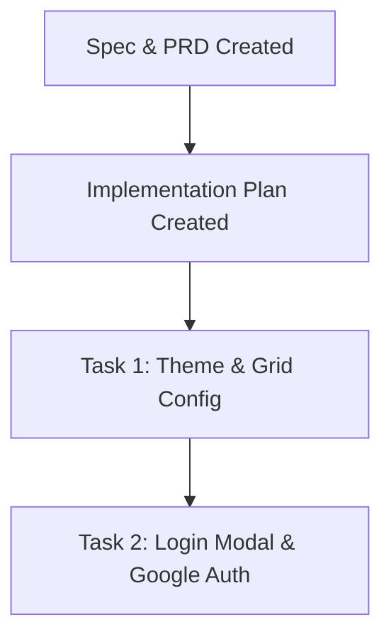

# Agent Memory: Work Tracking & Context

This file serves as a persistent context buffer and memory bank for the coding agents working on this project. It tracks current states, environment settings, and progress.

---

## 1. Project Context & Current Scope
- **Project**: blogging-website (React Frontend & Hono Backend)
- **Frontend Target**: Build a premium, responsive React 19 SPA optimized for `1600px` width grid on desktop.
- **Theme Palette**: Primary ocean blue (`#5996FF`), canvas background (`#FFFFFF`), with custom glassmorphism states.
- **Core Integrations**:
  1. Hono Backend API on local port `8787` (proxied from `5173`).
  2. Modal-based Authentication (Login Modal replacing standalone login page).
  3. Google OAuth for regular readers (auto-registers USER role).
  4. Email/Password credentials for Managers/Admins.
  5. Permanent floating AI Chatbot widget in the bottom-right corner.
  6. Signed direct-to-cloud media upload to Cloudinary.
  7. Interactive visual TipTap editor with togglable Focus Mode.
  8. Standalone verify, profile settings (password generation), and reset password pages.

---

## 2. Key Environment Variables & Parameters
### Backend (`wrangler.jsonc` vars)
- `FE_URL`: `http://localhost:5173`
- `JWT_ACCESS_SECRET` / `JWT_REFRESH_SECRET`
- `MISTRAL_API_KEY`: Configured for AI chatbot.
- `CLOUDIANRY_CLOUD_NAME` / `CLOUDINARY_API_KEY` / `CLOUDINARY_API_SECRET`
- `SMTP_HOST`: `localhost` / `SMTP_PORT`: `1025` (Mailpit UI: `http://localhost:8025`)

### Frontend Configured Variables
- **Figma File Key**: `qGveQS5j2mojQjD8DwrUmh`
- **Figma Access Token**: Configured in `/home/cloud/.gemini/antigravity-ide/mcp_config.json`.
- **Figma Nodes Analyzed**:
  - Homepage Frame: `1:95`
  - Article Detail Page Frame: `1:405`
  - Sharing/Share bar details: `1:572` - Facebook, Twitter, Pinterest
  - Category Badge Details: `1:225` - uppercase inline frames

---

## 3. Current Progress & Work Pointer

- [x] **Spec Analysis & Creation**: Completed `be-prd.md` and `fe-prd.md` under `docs/`.
- [x] **Trash Restoration**: Restored `apps/frontend` from trash back to the workspace.
- [x] **Figma Structure Discovery**: Downloaded and analyzed Figma node trees (`1:95` and `1:405`) using Figma API & token.
- [x] **Implementation Plan**: Written to `tasks/plan.md` and `tasks/todo.md`.
- [x] **Task 1: Design Configuration**: Configured primary color variables and max-width 1600px wrapper.
- [x] **Task 2: Login Modal Integration**: Implemented LoginModal and added global triggers across Home, Blog, PostDetail, and ChatWidget components.
- [x] **Task 3: Axios Client Configuration**: Implemented JWT authorization headers binding and auto-refresh token interceptor with mock data support.
- [x] **Task 4: Homepage Redesign**: Re-implemented the homepage with the premium Figma layout, high typography contrast, larger sizes, and high-quality mock tech content matching backend schemas.
- [x] **Task 5: Blog Archive Feed**: Redesigned `/blog` with the search bar, category filters integrated into the page body, clean headings, and name/email fields matching the Subscriber model.
- [ ] **Current State**: Working on Task 6: Article Details Page & Interactive Comment Section.

---

## 4. Instructions for Next Agent
- Cross-reference all edits with `/docs/be-prd.md` to ensure exact API payload matching.
- Execute tasks incrementally following `/tasks/todo.md` and check them off as completed.
- Ensure the ocean blue theme `#5996FF` and `max-w-[1600px]` constraints are strictly set up in Task 1.
